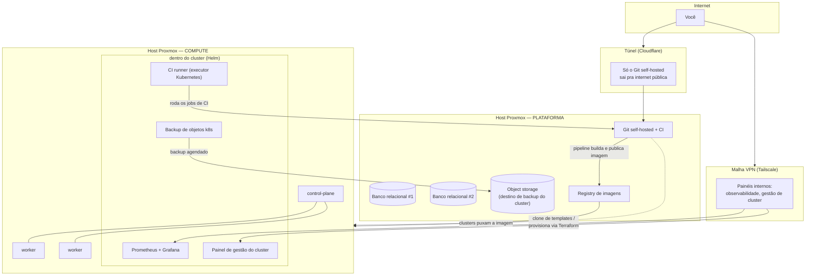

# proxmox-homelab-iac

Infraestrutura como Código para um homelab Proxmox de 2 nós, usado como
laboratório de prática de DevOps/SRE: provisionamento com Terraform,
cluster Kubernetes (k3s) via IaC, e a base para GitOps/observabilidade por
cima.

Este repositório é a versão **pública e didática** de um lab pessoal em
produção — mostra o "como" (templates, módulos Terraform, decisões de
design) sem expor topologia, credenciais ou qualquer dado real do
ambiente. Cada exemplo usa placeholders (`<SEU_...>`) e faixas de rede de
documentação (`10.0.10.0/24`) no lugar de valores reais.

## O que tem aqui

| Pasta | Conteúdo |
|---|---|
| [`proxmox-templates/debian-12/`](./proxmox-templates/debian-12/) | Runbook: como construir um template cloud-init de Debian 12 no Proxmox (imagem, customização, conversão em template) |
| [`k3s-cluster/`](./k3s-cluster/) | Módulos Terraform (provider [`bpg/proxmox`](https://registry.terraform.io/providers/bpg/proxmox)) para provisionar um cluster k3s (1 control-plane + N workers) a partir de um template cloud-init |

Este repositório cresce junto com o lab: cada peça nova (CI/CD self-hosted,
GitOps, observabilidade, backup) ganha sua versão didática aqui conforme
fica pronta na infra real.

## Arquitetura do lab (visão geral)

Dois hosts Proxmox físicos, cada um com um papel fixo — evita os dois
competirem por RAM/CPU pelo mesmo tipo de carga:

- **Nó de compute**: hospeda só o cluster k3s (control-plane + workers) e
  os templates de VM. Toda a folga de RAM do host vai pro cluster.
- **Nó de plataforma**: Git self-hosted + CI runner, bancos de dados,
  registry de imagens de container, backup. Nada de Kubernetes aqui — só
  os serviços que o resto do lab consome.

**Decisões de design que valem explicar** (o "porquê", não só o "o quê"):

- **Provider Terraform: [`bpg/proxmox`](https://registry.terraform.io/providers/bpg/proxmox)**, não o mais popular `Telmate/proxmox` — o `bpg` fala com a API do Proxmox nativamente para operações de disco em VMs clonadas de template cloud-init, sem precisar de um `provisioner remote-exec` fazendo SSH direto no hypervisor como root só para corrigir o `scsi0` pós-clone. Isso elimina uma dependência de acesso irrestrito ao host só para contornar uma limitação do provider.
- **Instalação do k3s via Terraform (`remote-exec` ao *guest*, nunca ao host), não via Ansible** — o cluster nasce pronto num único `terraform apply`; configuração pós-cluster (addons, hardening) é responsabilidade de uma camada separada.
- **DNS explícito via cloud-init, nunca herdado do template** — um template com `resolv.conf` já configurado (por exemplo, apontando pra uma VPN de outra máquina) quebra a resolução de nomes de qualquer VM clonada dele, silenciosamente: `curl | sh -` sem saída do `curl` ainda faz o `sh` do lado direito do pipe sair com código 0, mascarando o erro. Todo módulo aqui força servidores DNS explícitos.
- **Login por chave SSH, senha como fallback opcional** — os módulos aceitam senha de cloud-init, mas o default é `null` (login só por chave).
- **Um cluster só → cluster local em vez de cluster de gestão separado** — quando você só tem um cluster Kubernetes pra gerenciar (não vários downstream), o padrão de mercado de "cluster de gestão dedicado" é overhead desnecessário; ferramentas de gestão rodam dentro do próprio cluster que gerenciam.

## Como usar

Cada pasta tem seu próprio README com o passo a passo. Em resumo:

1. Construa (ou já tenha) um template cloud-init no Proxmox — ver
   [`proxmox-templates/debian-12/`](./proxmox-templates/debian-12/).
2. Copie `k3s-cluster/terraform/example/terraform.tfvars.example` para
   `terraform.tfvars`, preencha com os dados do seu ambiente (nunca
   versionar esse arquivo — já vem no `.gitignore`).
3. `terraform init && terraform plan && terraform apply` dentro de
   `k3s-cluster/terraform/example/`.

## Licença

[MIT](./LICENSE) — use, adapte, aprenda.
